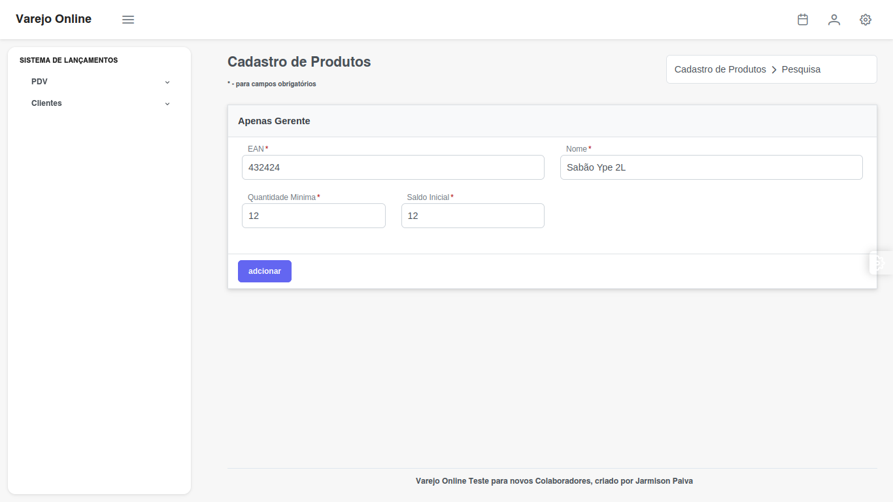
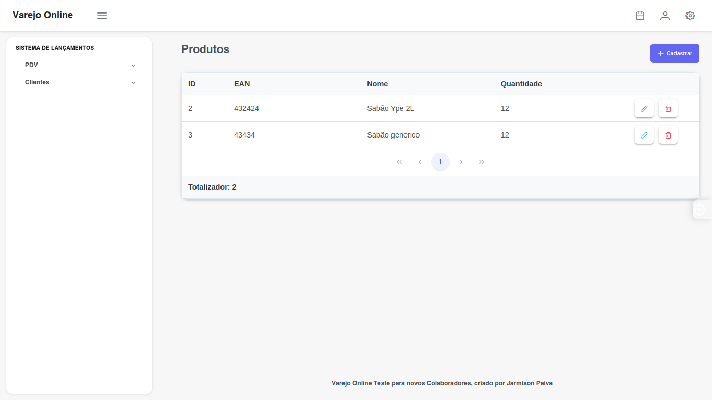
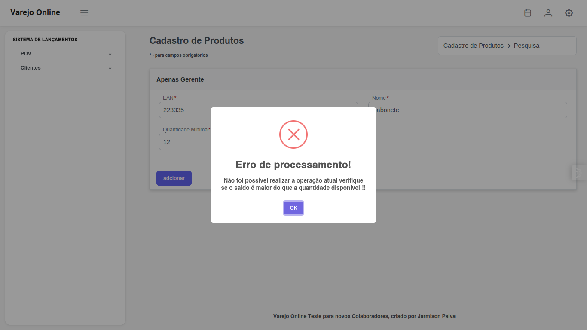
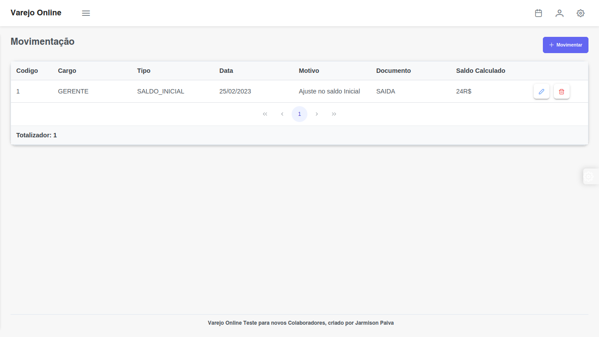
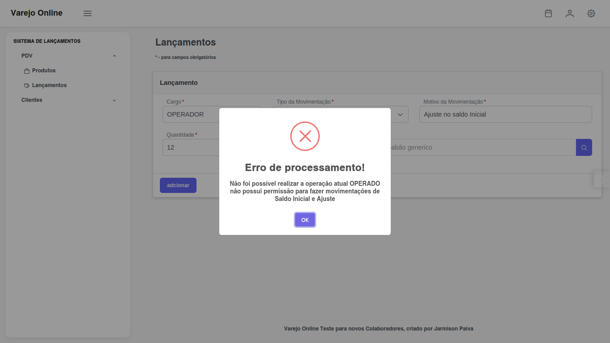
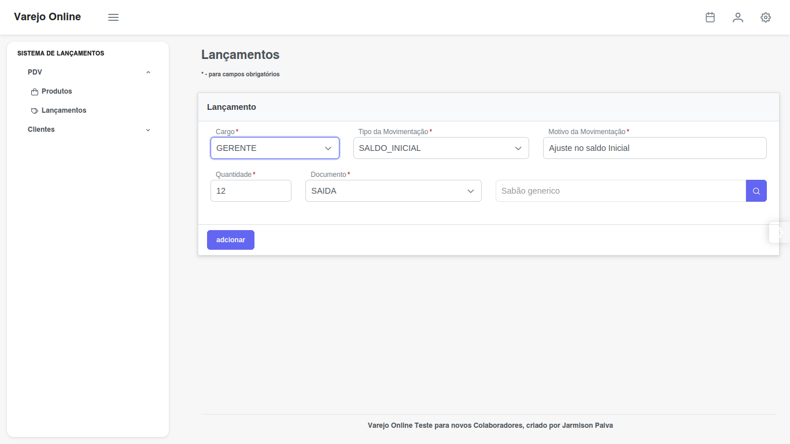
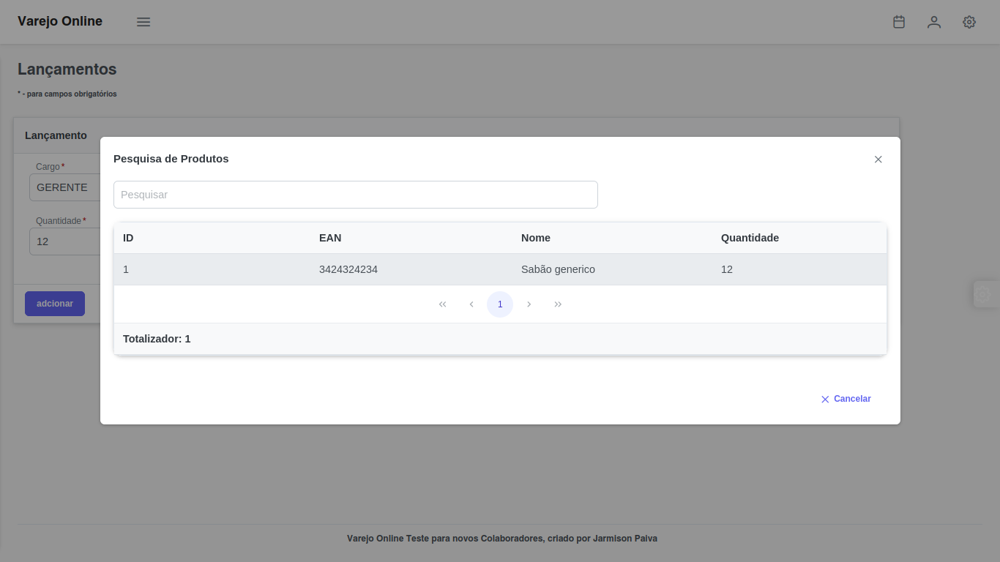
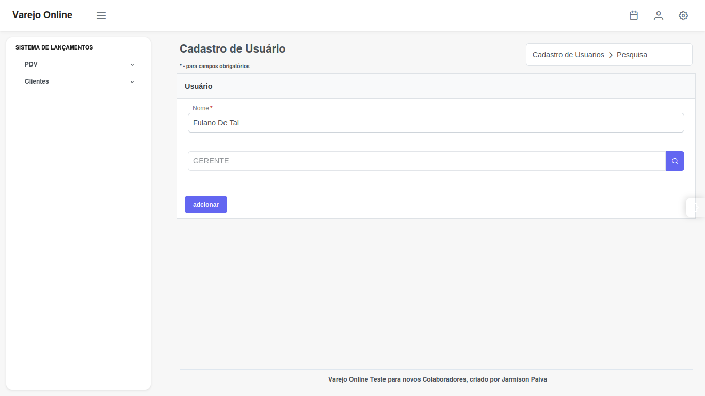
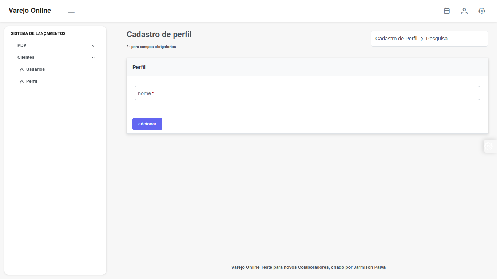

# Desafio Varejo Online

### Tecnologias e requisitos
A pasta backend possui o json como massa de teste, utilizar para testar os endpoints, servindo assim como dodcumentação da API VarejOnline, segue abaixo do README tecnologias e também algumas imagens relacionada ao front end:

* Spring Boot
* Java 11 +
* Angular 12+
* H2 DataBase
* Spring Security

### Requisitos funcionais
Amostra do que foi pedido regras de negocios do backend:

* 1- Deverão existir 2 perfis de usuários para o acesso 
* 2- O sistema deverá ter uma tela para permitir o cadastro e edição de produtos
*  3- O sistema deverá ter uma tela para permitir o lançamento das movimentações de estoque com os seguintes campos (GERENTE e OPERADOR):
* 4- O sistema deverá ter uma tela para listar as movimentações de estoque com os seguintes campos:

### Produtos e Movimentações de Estoque
Tela de cadastro de produtos, possuindo validações para não salvar caso o saldo seja menor que a quantidade minima.

Validação de Permissões ao cadastrar o Produto.

Listagem de Produtos nessa aba é possivel acessar o cadastro de produtos, edição de produtos e a remoção dele, possuindo
validações caso esse produto esteja em uso na aba de lançamentos o sistema reconhece que o produto ja possui lançamentos e assim alerta ao usuário uma mensagem de erro.

Validação ao processar o cadastro de produto caso o saldo seja inferior a quantidade o sistema alerta uma mensagem de erro, avisando que o saldo atual é invalido.

Listagem de movimentos pode ser acessada nessa aba, sendo assim calculado automaticamente o valor do saldo final, SAIDAS,ENTRADAS,AJUSTES e etc.
Também é possivel remover o lançamento ou ver os detalhes do lançamento no sistema e realizar uma nova movimentação.

Validação de Lançamentos no caso o operador não terá permissão para fazer a movimentação caso a movimentação seja de SALDO INICIAL OU AJUSTE, apenas o gerente pode fazer esse lançamento.

Tela de lançamentos onde será possivel pesquisar por produtos disponiveis no estoque, quando o usuário clicar na caixa onde é possivel perceber um icone de lupa, ao clicar o usuário tera acesso a uma lista de produtos sendo possivel pesquisar pelo nome do produto codigo de barras chamado EAM, e ao clicar no produto será preenchido automaticamente o input.

Ao clicar em cima do produto será possivel selecionar um determinado produto que está  no estoque.

### Usuarios e Perfis

Telas de cadastro,edição,remocação e edição de Usuários e seus respectivos Perfis.

O cadastro de Usuário possui a mesma logica será listado os perfis disponiveis de acesso ao usuário, assim será designado o que cada usuario poderá fazer dentro do sistema seja fazer determinados tipos de lançamentos entre outros.

